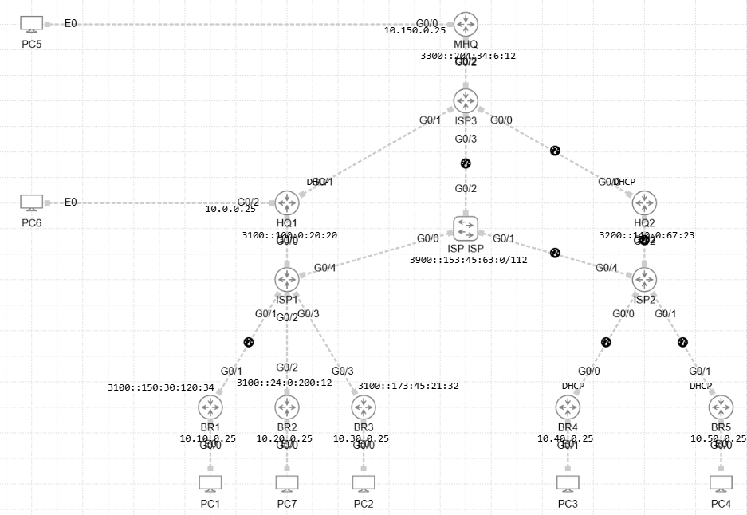

# 📡 Troubleshoot DMVPN 01

## 🖼️ Topology

Below is the high-level topology used in this lab:

## 🛠️ Lab Configuration Overview

- **Technology Stack:**
  - Hierarchical IPv4overIPv6 DMVPN Phase 3 (GRE over IPSec with IKEv2)
  - Overlay Tunnel Network: `192.168.0.0/24`
  - Named EIGRP (AS 160) for dynamic routing
- **Key Devices:**
  - MHQ (Hub Tunnel30)
  - HQ1 (Hub Tunnl10, Spoke Tunnel30), HQ2 (Hub Tunnl20, Spoke Tunnel30),
  - BR1, BR2, BR3 (Spokes Tunnel10)
  - BR4, BR5 (Spokes Tunnel20)
  - ISP1, ISP2, ISP3, ISP-ISP (Transit/Internet Simulation)
  - PC1–PC7 (End devices connected to each branch/HQ)
  - Some links have extra latency 100ms (for problem 2)

## 🎯 Task

Problems:
Users from HQ2, BR4 and BR5 complain that they cannot access network beyond their region (HQ2, BR4, BR5)
Users from BR4 have greater delay compare to BR3 when they try access the same resources*
Users from BR3 cannot access rest of corporate network

Troubleshooting TASKs:
All users should have full conectivity to each others

*Try to ping 10.10.0.25 from BR4, BR5 and compare delay
 Try also ping 10.50.0.25 from BR4 and ping 10.40.0.25 from BR5  
 Let's think why it happened.
