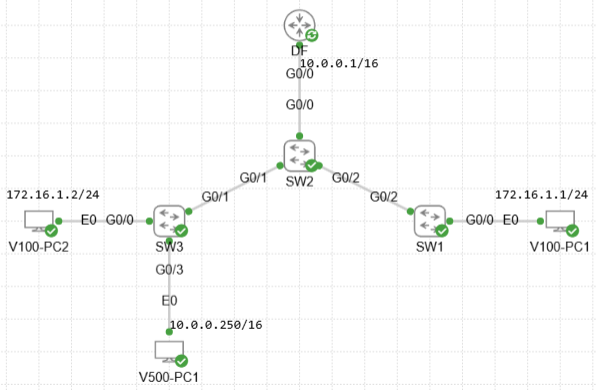

# 🔁 ENCOR CH1 Layer 2 Forwarding

## 📘 Project Overview

This project provides a lab environment built in **Cisco CML** for hands-on practice with **Layer 2 forwarding concepts and VLAN configurations**.

The lab **ENCOR_CH1_Layer_2_Forwarding.yaml** is pre-configured with:

- Basic Layer 2 topology
- End devices with pre-set IP addressing
- Partial device configuration

## 🧪 Environment

- **Platform:** Cisco CML  
- **Router/Switch Type:** IOSv / IOSvL2 / Desktop

## 🎯 Task

Your task is to configure Layer 2 connectivity using VLANs and routing where required. Specifically, you will:

1. Configure **Native VLAN 88** on trunk ports and **limit allowed VLANs** to V100, V500, and V700–V800.
2. Ensure:
   - V100-PC1 and V100-PC2 are in **VLAN 100 (L2 only)**,
   - V500-PC1 and DF router use **VLAN 500 (with L3)**,
   - Configure **SW1 interface g0/1 as routed** and assign IPv6 address `2001:db8::A/128`.
3. Test end-to-end **IP and L2 connectivity** between PCs and DF.

> 🔍 The specific instructions and topology references are embedded as notes inside the lab. Explore the CML simulation for guidance.

## 🖼️ Topology

Below is the high-level topology used in this lab:

## ✅ Goal

Once completed, your configuration should support full Layer 2 forwarding including proper VLAN segmentation and trunking behavior, as well as L3 integration via DF router.

Compare your results with the example solution in the `solution/` directory.

Happy labbing! 🚀