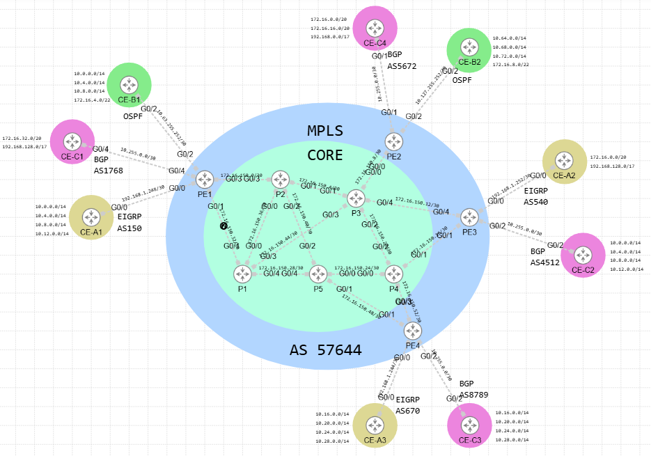

# 🛠️ MPLS Layer 3 VPN Lab

## 🌐 Project Overview

This project demonstrates the implementation of **MPLS Layer 3 VPN** services in a service provider network, built and simulated using **Cisco CML**. The goal is to emulate a real-world MPLS VPN deployment, where multiple customers are connected to a shared provider backbone using different routing protocols.

The lab includes:

- A fully operational **provider core** using:
  - **IS-IS** as the Interior Gateway Protocol (IGP)
  - **BFD (Bidirectional Forwarding Detection)** for fast failure detection
  - **LDP (Label Distribution Protocol)** for label switching
  - **MP-BGP VPNv4** for route distribution
  - An **iBGP Route Reflector**

- **Multiple customer sites** connected using:
  - **OSPF**
  - **EIGRP**
  - **eBGP**

Each customer is placed in a separate **VRF** (Virtual Routing and Forwarding) instance.

## 🧪 Technologies Used

| Role            | Technology                          |
|-----------------|--------------------------------------|
| IGP (Provider)  | IS-IS + BFD                          |
| MPLS            | LDP                                  |
| VPN Signaling   | MP-BGP (VPNv4 address family)        |
| BGP Core        | iBGP with Route Reflector            |
| Customer Access | OSPF, EIGRP, or eBGP per customer    |

## 🖼️ Topology

The diagram below illustrates the MPLS VPN topology, with separate customer domains connected through a common MPLS provider core:

> Each CE router uses a different routing protocol, demonstrating interoperability within the MPLS VPN model.

## 🎯 Lab Objectives

1. Deploy MPLS infrastructure with IS-IS, LDP, and BFD in the provider core.
2. Configure MP-BGP VPNv4 on PE routers and a Route Reflector.
3. Assign VRFs and configure routing protocols between PE routers and CE routers:
   - EIGRP for Customer A
   - OSPF for Customer B
   - BGP for Customer C
4. Verify end-to-end connectivity between customer sites via MPLS VPN.
