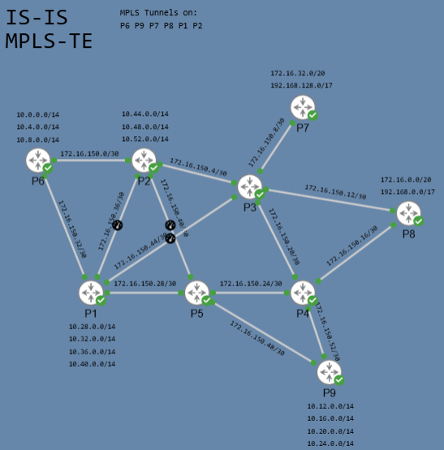

# 📡 MPLS-TE + FRR Lab (Cisco CML)

## 📘 Project Overview

This project provides a lab environment built in **Cisco CML** for hands-on practice with **MPLS Traffic Engineering (MPLS-TE)** and **Fast Reroute (FRR)** mechanisms.

The lab **MPLS_Traffic_Engineering.yaml** is pre-configured with:

- IP addressing,
- **IS-IS TE** as the IGP routing protocol,
- **MPLS-TE** enabled on all relevant routers.

## 🧪 Environment

- **Platform:** Cisco CML
- **Router Type:** IOSv 
- **Routing Protocol:** IS-IS with Traffic Engineering extensions
- **Signaling Protocol:** RSVP-TE

## 🎯 Task

Your task is to configure **MPLS-TE tunnels** between selected routers and implement **Fast Reroute (FRR)** to ensure backup paths in case of link failures.

> 🔍 The specific instructions and scenarios are **embedded inside the lab** itself via notes. Please explore the CML simulation to discover them.

## 🖼️ Topology

Below is the high-level topology used in this lab:

> If the topology image is not visible, please open `topology.png` located in the root of the project folder.

## 🧵 PCAP File

The file `traffic_P3-P7.pcap` contains captured traffic between routers **P3** and **P7**, including **MPLS-TE signaling** and **data-plane traffic**. You can open it in **Wireshark** to analyze RSVP-TE sessions and label-switched paths (LSPs).

## ✅ Goal

Once completed, your configuration should support working MPLS-TE tunnels with operational **Fast Reroute (FRR)** protection.

Compare your results with the sample configurations in the `solution/` directory for validation.

Happy labbing! 🚀
